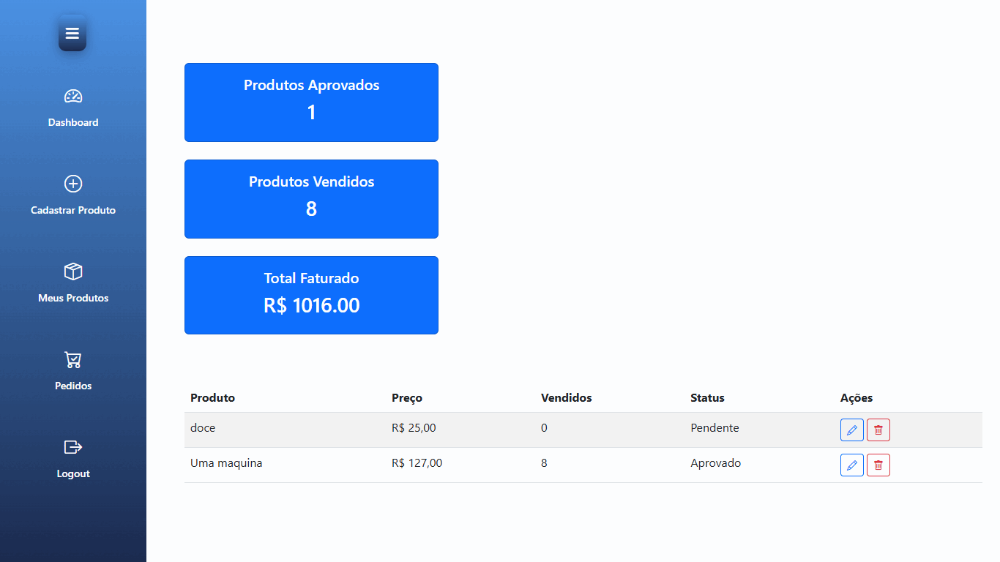
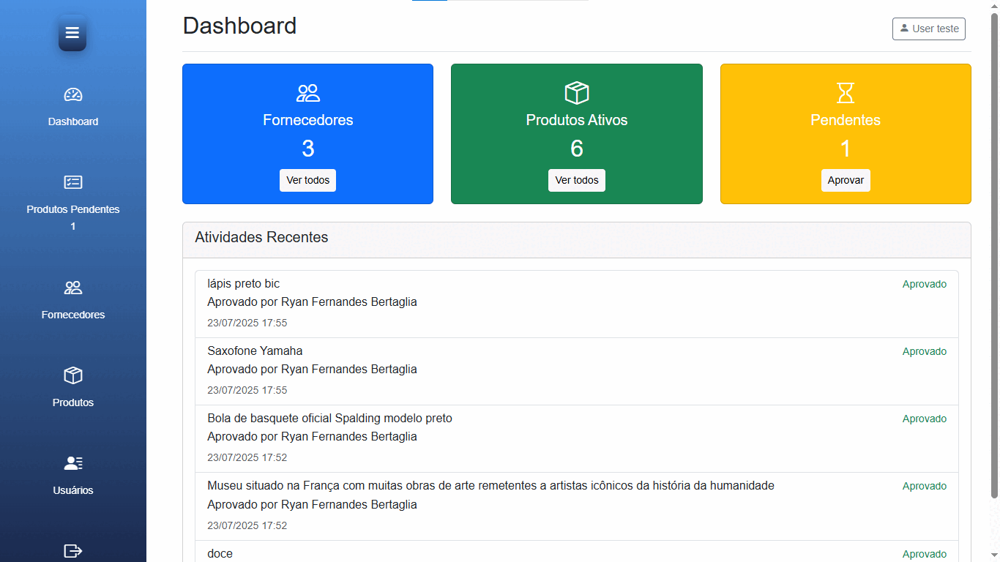

# Simulador de E-commerce

## Descrição
Este projeto é um sistema de e-commerce simplificado, que permite que usuários realizem compras, fornecedores cadastrem produtos e administradores gerenciem aprovações, saldos e retirar dados sobre usuários e fornecedores. Assim, o sistema inclui funcionalidades de autenticação, listagem de produtos, carrinho de compras, processamento de pedidos e debitação de salde de quem compra e a adição dele na conta do fornecedor.

## Funcionalidades

### Usuário
- Visualizar catálogo de produtos
- Realizar cadastro e login
- Adicionar produtos ao carrinho
- Realizar checkout com validação de saldo
- Criar pedidos e efetuar pagamentos

### Fornecedor
- Realizar cadastro e login
- Cadastrar novos produtos
- Acompanhar o status de aprovação dos produtos

### Administrador
- Realizar login como administrador
- Visualizar produtos pendentes de aprovação
- Aprovar ou recusar produtos cadastrados pelos fornecedores
- Alterar o saldo dos usuários

## Tecnologias e Padrões Utilizados

- **PHP 8**
- **MySQL**
- **HTML, CSS e JS**
- **Responsividade**

